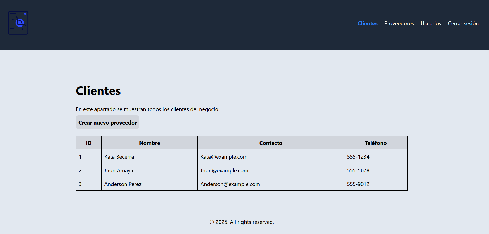
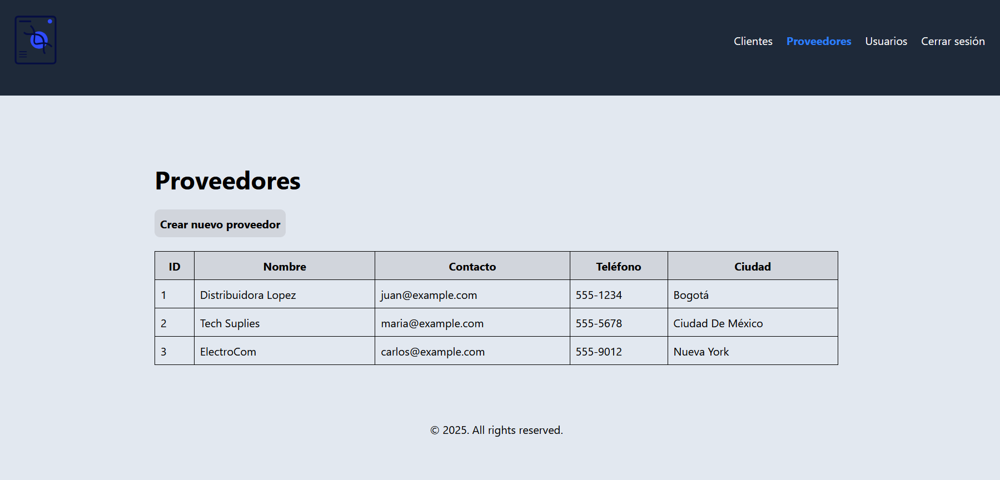

# React + TypeScript + Vite

Este proyecto es un panel administrativo sencillo que permite gestionar información de manera eficiente a través de una interfaz amigable. Está diseñado como base para sistemas más complejos. Fue desarrollado con React con TypeScript, y para el Css se usó el framework Tailwind Css.  

---

## 📑 Secciones principales

- [📦 Proveedores](#-proveedores)
- [👥 Clientes](#-clientes)
- [🔐 Usuarios](#-usuarios)
- [🚪 Log out](#-log-out)

---

## 🛠️ Tecnologías utilizadas

| Tecnología | Descripción |
|-----------|------------|
| React | Biblioteca para construir interfaces de usuario |
| Vite | Herramienta de desarrollo rápida para proyectos frontend |
| Tailwind CSS | Framework de estilos basado en utilidades |
| React Router DOM | Manejo de rutas en aplicaciones React |


---

---

## 📸 Capturas del sistema

### 👥 Usuarios
<p align="center">
  
</p>

### 🧑‍💼 Clientes
<p align="center">
  
</p>

### 📦 Proveedores
<p align="center">
  
</p>

---

## ▶️ Ejecutar la aplicación

Sigue estos pasos para correr el proyecto en modo desarrollo:

```bash
npm install
npm run dev
